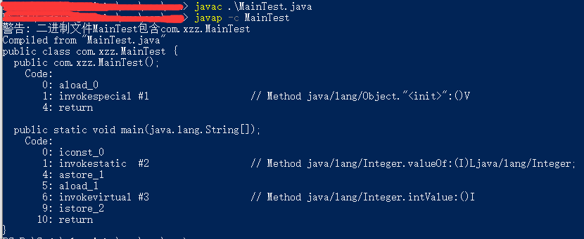

# Java自动拆装箱(Autoboxing and unboxing)学习

------

在学习并发的过程中，用“Boolean bool = true”的自动装箱方式初始化了两个对象锁去锁两块代码，结果运行的时候出现了竞争等待，调试了一下发现两个锁变量指向的是同一个对象，由此可见我对自动拆装箱的机制想的太简单了，查了一下，发现这个机制还挺细节，那就记录一下：

本文主要有以下几个方面：
> * 什么是自动拆装箱
> * 拆装箱的实现
> * 拆装箱发生的场景
> * 关于String
> * 回首望月

不当之处，欢迎指正！

------

## 一. 什么是自动拆箱与装箱

我们都知道，Java定义了8种基本类型和与之对应的8中包装器，其中6种数据类型，1种字符类型以及1种布尔类型：

在Java5之前，定义生成一个Integer包装器类型的对象，只能通过以下方式：
```java
Integer i = new Integer(0);
```
Java5支持了基本类型和对应的包装类型之前的自动转换机制，即自动拆箱（包装器类型转换成基本类型）与装箱（基本类型封装成包装器类型）。于是，就有了以下两行代码：
```java
Integer i = 0; //自动装箱
int j = i;     //自动拆箱
```

## 二. 自动拆装箱的实现（int-Integer为例）
我们将自动拆装箱的代码反编译一下，拆装箱的动作就一目了然。
```java
public class MainTest {
    public static void main(String[] args) {
        Integer i = 0;
        int j = i;
    }
}
```
反编译后(这张图片后面更新过，所以是蓝色的)：

通过反编译的结果看，在"Integer i = 0"自动装箱的过程中，调用了Integer.valueOf(int i)方法；在"int j = i;"的自动装箱的过程中，调用了Integer.intValue()方法。

其中拆箱方法Integer.intValue()方法很简单：
```java
    /**
     * Returns the value of this {@code Integer} as an
     * {@code int}.
     */
    public int intValue() {
        return value;
    }
```
只是返回了当前对象的value值，没什么好说的。

但是装箱方法Integer.valueOf(int i)就有细节了，一起看下：
```java
    /**
     * Returns an {@code Integer} instance representing the specified
     * {@code int} value.  If a new {@code Integer} instance is not
     * required, this method should generally be used in preference to
     * the constructor {@link #Integer(int)}, as this method is likely
     * to yield significantly better space and time performance by
     * caching frequently requested values.
     *
     * This method will always cache values in the range -128 to 127,
     * inclusive, and may cache other values outside of this range.
     *
     * @param  i an {@code int} value.
     * @return an {@code Integer} instance representing {@code i}.
     * @since  1.5
     */
    public static Integer valueOf(int i) {
        if (i >= IntegerCache.low && i <= IntegerCache.high)
            return IntegerCache.cache[i + (-IntegerCache.low)];
        return new Integer(i);
    }
```
这边的源码比预想的多了一个细节操作，值落在[IntegerCache.low, IntegerCache.high]区间上时，是直接从一个Integer类型的缓存数组IntegerCache.cache中取一个对象返回出去，值不在这个区间时才new一个新对象返回。
看一下IntegerCache的实现，它是Integer类的一个私有静态内部类：
```
    /**
     * Cache to support the object identity semantics of autoboxing for values between
     * -128 and 127 (inclusive) as required by JLS.
     *
     * The cache is initialized on first usage.  The size of the cache
     * may be controlled by the {@code -XX:AutoBoxCacheMax=<size>} option.
     * During VM initialization, java.lang.Integer.IntegerCache.high property
     * may be set and saved in the private system properties in the
     * sun.misc.VM class.
     */

    private static class IntegerCache {
        static final int low = -128;
        static final int high;
        static final Integer cache[];

        static {
            // high value may be configured by property
            int h = 127;
            String integerCacheHighPropValue =
                sun.misc.VM.getSavedProperty("java.lang.Integer.IntegerCache.high");
            if (integerCacheHighPropValue != null) {
                try {
                    int i = parseInt(integerCacheHighPropValue);
                    i = Math.max(i, 127);
                    // Maximum array size is Integer.MAX_VALUE
                    h = Math.min(i, Integer.MAX_VALUE - (-low) -1);
                } catch( NumberFormatException nfe) {
                    // If the property cannot be parsed into an int, ignore it.
                }
            }
            high = h;

            cache = new Integer[(high - low) + 1];
            int j = low;
            for(int k = 0; k < cache.length; k++)
                cache[k] = new Integer(j++);

            // range [-128, 127] must be interned (JLS7 5.1.7)
            assert IntegerCache.high >= 127;
        }

        private IntegerCache() {}
    }
```
IntegerCache中有3个final类型的变量：
>**low**：-128（一个字节能够表示的最小值）；
**high**：127（一个字节能够表示的最大值），JVM中设置的属性值（通过-XX:AutoBoxCacheMax=<size>设置）二者取大值，再和Integer.MAX_VALUE取小值；
**cache**：在静态块中初始化为由区间[low, high]上的所有整数组成的升序数组。

综上，Java在虚拟机堆内存中维持了一个缓存池，在装箱的过程中，如果发现目标包装器对象在缓存池中已经存在，就直接取缓存池中的，否则就新建一个对象。

测试一下：
```java
    public static void main(String[] args) {
        Integer i = 127;
        Integer j = 127;
        System.out.println(System.identityHashCode(i));  //本地输出i的地址：1173230247
        System.out.println(System.identityHashCode(j));  //本地输出j的地址：1173230247
        
        Integer m = 128;
        Integer n = 128;
        System.out.println(System.identityHashCode(m));  //本地输出m的地址：856419764
        System.out.println(System.identityHashCode(n));  //本地输出n的地址：621009875
    }
```
由测试结果来看，值为127时，两次装箱返回的是同一个对象，值为128时，两次装箱返回的是不同的对象。

因为小数的区间取值无限，所以float->Float，double->Double两种类型装箱机制没有缓存机制，其他5中基本类型的封装机制也是类似int->Integer的装箱套路，不过缓存的边界不可改变：

| 基本类型 | 包装器类型 | 缓存区间 | 缓存是否可变 |
| :-----| :---- | :----: | :----: |
| byte        |   Byte   |   [-128, 127] |不可变|
| short        |   Short   |   [-128, 127] |不可变|
| int         | Integer  |   [-128, 127] |上限可设置|
| long        |   Long   |   [-128, 127] |不可变|
| float        |   Float   |   -- |--|
| double        |   Double   |   -- |--|
| char        |   Character   |   [0, 127] |不可变|
| boolean        |   Boolean   |   {true, false} |不可变|

因为基本类型对应的包装器都是不可变类，多以他们的缓存区间一旦初始化，里面的值就无法再改变，所以在JVM运行过程中，所有的缓存池都是不变的。

## 三. 拆装箱发生的场景
### 1.定义变量和方法参数传递：
这里的拆装箱是指开发者通过编写代码控制的拆装箱，比较明显：
```java
    public static void main(String[] args) {
        Integer i = 0;   //装箱
        int j = i;       //拆箱
        aa(i);           //拆箱，传值时发生了：int fi = i;
        bb(j);           //装箱，传值时发生了：Integer fi = j;
    }
    private static void aa(int fi){
    }
    private static void bb(Integer fi){
    }
```

### 2.运算时拆箱
我们都知道，当一个变量的定义类型不是基本类型，其实变量的值是对象的在虚拟机中的地址，当用初始化后的包装器类型变量进行运算时，会发生什么呢？
#### 1.“+，-，*，/ ...”等运算时拆箱
当用包装器类型的数据进行运算时，JAVA会先执行拆箱操作，然后进行运算。
```java
public class MainTest {
    public static void main(String[] args) {
        Integer i = 127;
        Integer j = 127;
        i = i + j;
    }
}
```
将上面一段代码反编译：

发现，除了在分别源码的3,4行进行了装箱操作后，在执行add操作之前，有两次拆箱操作，add之后，又把结果装箱赋值给变量i。

#### 2.“==”判等运算
“==”运算比较特殊：
> A == B
> * 当A,B都是基本类型时，直接进行比较两个变量的值是否相等
> * 当A,B都是包装器类型时，比较两个变量指向的对象所在的地址是否相等
> * 当A,B中有一个是基本类型时，会将另一个包装器类型拆箱成基本类型，然后再进行基本类型的判等比较

测试如下：
```java
    public static void main(String[] args) {
        int m = 128;
        int n = 128;
        Integer i = 128;
        Integer j = 128;
        System.out.println(m == n);  //输出：true
        System.out.println(m == i);  //输出：true
        System.out.println(i == j);  //输出：false
    }
```
前文已经说了，JVM没有设置Integer类型的缓存上限的时候，128不在缓存池内，所以两次封装后的对象是不同的对象。在此基础上：
> * 第6行输出true：如果比较的是装箱后的对象地址，结果肯定是false，实际结果是true，说明比较的是基本类型的值，没有发生自动拆装箱动作
> * 第7行输出true：如果比较的是装箱后的对象地址，结果肯定是false，实际结果是true，说明比较的是基本类型的值，那么包装器类型的变量肯定进行了自动拆箱动作
> * 第8行输出false：如果比较的是拆箱后的基本类型的值，结果肯定是true，实际结果是false，说明比较的是对象的地址，没有发生自动拆装箱动作

看一下反编译的结果：

源码中除了第4、5行出现了自动装箱动作，就只有在第7行发生了自动拆箱动作。

## 四. 关于String类型
String类型没有对应的基本类型，所以没有自动拆装箱的机制，之所以在这里提一下，是因为String的初始化过程和自动装箱的过程很像。
```java
    public static void main(String[] args) {
        String s1 = "hello";
        String s2 = "hello";
        String s3 = new String("hello");
        String s4 = new String("hello");
        System.out.println(System.identityHashCode(s1)); //输出s1地址：1173230247
        System.out.println(System.identityHashCode(s2)); //输出s2地址：1173230247
        System.out.println(System.identityHashCode(s3)); //输出s3地址：856419764
        System.out.println(System.identityHashCode(s4)); //输出s5地址：621009875
    }
```
从上面的输出结果可以看出，两个直接用字符串赋值的变量s1,s2指向的是同一个对象，而new String()生成对象赋值的变量s3,s4则是不同的对象。
其实，JVM中存在一个字符串缓存池，当直接使用字符串初始化变量的时候，JAVA会先到字符串缓存池中查看有没有相同值的String对象，如果有，直接返回缓存池中的对象；如果没有，就new出一个新的对象存入缓存池，再返回这个对象。而String的不可变性质则能保证在对象共享的过程中不会出现线程安全问题。
与基本类型的缓存池相比，String类型的缓存池在运行时是动态变化的。

## 五. 回首望月
回到最开始我碰到的问题，当我用“Boolean bool = true”的自动装箱方式定义变量的时候，这两个变量其实指向的都是Boolean类型的缓存池中的那个值为true的对象，所以用他们当做同步锁，其实是用的同一把锁，自然会出现竞争等待。

经验：当我们使用自动装箱机制初始化变量的时候，就相当于告诉JAVA这里需要一个对象，而不是告诉JAVA这里需要一个新的对象。当我们需要一个新的对象的时候，为了保险起见，自己new一个出来，比如锁。